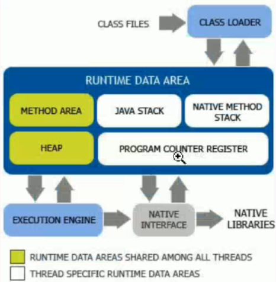
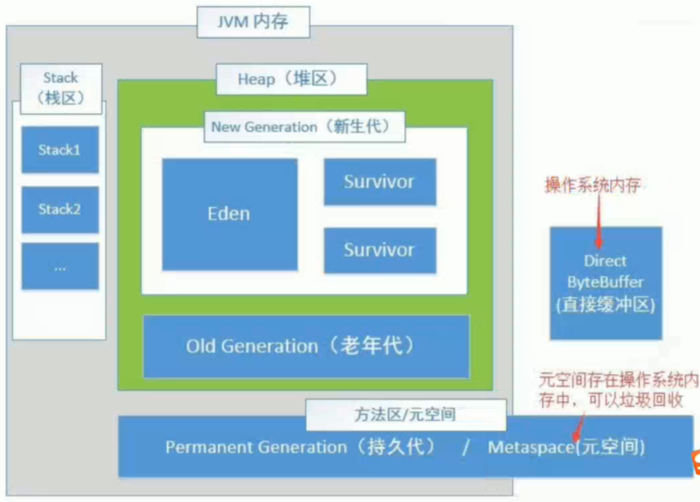

# JVM 

Java的体系结构如下

  

## ClassLoader

### 双亲委派机制

ClassLoader有三个：BootstrapClassLoader(爷爷)、ExtClassLoader(爸爸)、AppClassLoader(自个)

- BootStrapClassLoader：预先加载系统的类（%JAVA_HOME%/jre/lib/rt.jar）
- ExtClassLoader：预先加载扩展包（%JAVA_HOME%/jre/lib/ext/*.jar）
- AppClassLoader：等使用时才载入应用开发的classes以及lib下的类（￥CLASSPATH）

每次加载类时，AppClassLoader会委托ExtClassLoader，而ExtClassLoader委托BootstrapClassLoader进行加载。

当我们自己写一个java.lang.String时，委托到BootstrapClassLoader会加载到系统的String，子类就不能再加载了；所以双亲委派机制起到了防止重复加载的作用（安全）。

## Java栈

引用、基本数据类型

native声明：Native是操作系统底层的方法，Java调用不到，只能通过JNI去调用。

再做补充。。。

码农翻身视频

## PROGRAM COUNTER REGISTER

JVM每执行一行代码，会将其行数记录下来；一旦报错的时候，可以返回出错位置。

## Heap堆

  

### 新生代

new的对象存入Eden区，当Eden（伊甸园）满了。GC进行[垃圾回收](??)，没被销毁的对象会存入到Survivor存活区中（存活区有两个，from区 和 to区交替使用）

### 老年代

当存活区满了之后，就会将对象存入到老年代中。

### 持久代

持久代也是从老年代存过来的，不同的是持久代在物理上不是在堆中，而是在操作系统开辟一块空间。   

### 方法区

方法区里面有常量池，存放常量和基本类型常量。

## JVM调优

JVM调优主要针对堆内存调优，常用的参数如下：

| 参数                    | 描述                            |
| ----------------------- | ------------------------------- |
| -XX:+UseSerialGC        | 使用串行GC收集器                |
| -XX:+UseParallelGC      | 使用并行GC收集器                |
| -XX:+UseParallelOldGC   | 使用parallel old收集器          |
| -XX:+UseConcMarkSweepGC | 使用CMS收集器                   |
| -Xms                    | 初始化堆大小                    |
| -Xmx                    | 堆的最大大小                    |
| -XX:MaxPermSize=n       | 设置Permanent区（持久代）的大小 |
| -XX:NewSize=n           | 设置Young generation大小        |
| -XX:NewRatio=n          | 设置年轻代和年老代的比值        |
| -XX:+PrintGCDetails     | 查看堆空间情况                  |

## [Java垃圾回收](component/GC.md)  

## [强引用、弱引用、软引用、虚引用](component/Quote.md)  

不同引用的解释与举例